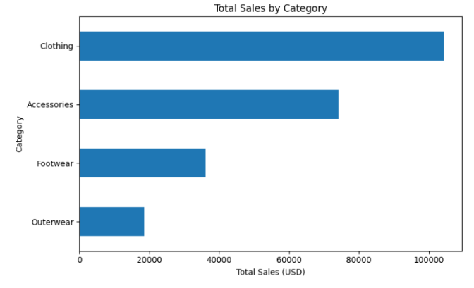
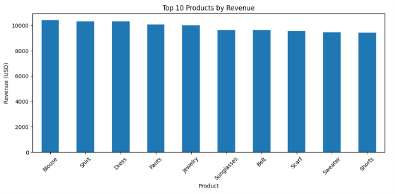
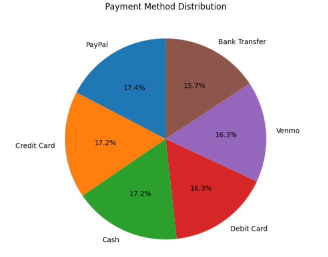
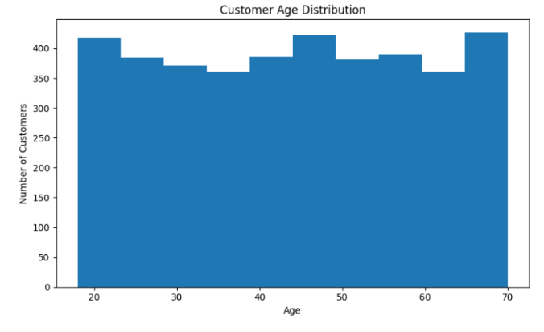

# 🛍️ Customer Shopping Behavior Analysis

## 📌 Project Overview

This project analyzes customer shopping behavior using **Python, SQL Server, and SQL**. The dataset was cleaned and transformed using Python before being imported into SQL Server for analytical querying. The project focuses on uncovering purchasing trends, customer demographics, subscription behavior, discount usage, and revenue insights through SQL-based analysis.

---

## 🛠️ Tech Stack

- Python
- Pandas
- SQL Server
- SQLAlchemy
- Matplotlib
- Jupyter Notebook

---

## 📂 Repository Structure

```
Customer-Shopping-Behavior-Analysis/
│
├── Dataset/
│   └── customer_shopping_behavior.csv
│
├── Images/
│   ├── Customer_Age_Distribution.png
│   ├── Payment_Method.png
│   ├── Sales_By_Category.png
│   └── Top_Products_by_Revenue.png
│
├── Notebook/
│   └── Customer_Shopping_Behavior_Analysis.ipynb
│
├── SQL/
│   └── Customer_Shopping_Analysis.sql
│
├── requirements.txt
│
└── README.md
```

---

## 📊 Project Workflow

### Data Preparation (Python)

- Imported the dataset using Pandas.
- Explored the data structure and summary statistics.
- Standardized column names.
- Handled missing values.
- Created new features for analysis.
- Removed redundant columns.
- Exported the cleaned dataset to SQL Server.

---

### SQL Analysis

The following business questions were answered using SQL:

1. Total revenue generated by male vs female customers.
2. Customers who received discounts but spent above the average purchase amount.
3. Top 5 highest-rated products.
4. Comparison of average purchase amount between Standard and Express Shipping.
5. Spending comparison between subscribed and non-subscribed customers.
6. Products with the highest percentage of discounted purchases.
7. Customer segmentation into New, Returning, and Loyal customers.
8. Top 3 most purchased products within each category using Window Functions.
9. Subscription behavior among repeat buyers.
10. Revenue contribution across different age groups.

---

## 📈 SQL Concepts Used

- SELECT
- WHERE
- GROUP BY
- ORDER BY
- Aggregate Functions
- CASE WHEN
- Subqueries
- Common Table Expressions (CTEs)
- Window Functions (`ROW_NUMBER()`)
- TOP
- ROUND

---

## 📷 Exploratory Data Analysis

### Sales by Category



---

### Top Products by Revenue



---

### Payment Method Distribution



---

### Customer Age Distribution



---

## 💡 Key Insights

- Clothing generated the highest overall sales.
- Certain products consistently received higher customer ratings.
- Repeat customers showed stronger subscription adoption.
- Discount campaigns influenced purchasing behavior across several products.
- Customer revenue varied across different age groups.
- Payment preferences were distributed across multiple payment methods.

---

## 🚀 Skills Demonstrated

- Data Cleaning
- Data Preprocessing
- Exploratory Data Analysis (EDA)
- SQL Query Writing
- Business Insight Generation
- SQL Server Integration
- Data Visualization
- Git & GitHub Project Organization

---

## ▶️ How to Run

### 1. Clone the repository

```bash
git clone https://github.com/KuldeepGhura/Customer-Shopping-Behavior-Analysis.git
```

### 2. Install dependencies

```bash
pip install -r requirements.txt
```

### 3. Open the Jupyter Notebook

Run all notebook cells to perform data cleaning and generate visualizations.

### 4. Import the cleaned dataset into SQL Server

Execute the SQL script inside the **SQL** folder to perform the analytical queries.

---

## 👨‍💻 Author

**Kuldeep Ghura**
